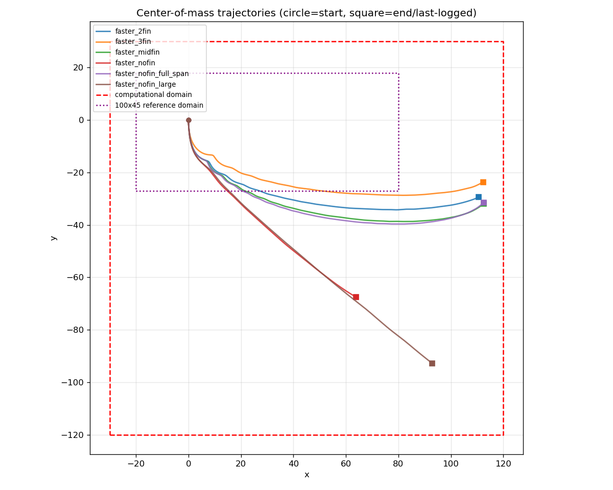

# Cases

Each subdirectory is one simulation case — a matched pair of *flow* parameters
(`input3d`) and *body* parameters (`geometry.json`), plus the point cloud
generated from the latter.

```
cases/<case-name>/
    README.md          what this case is and why      (hand-written, committed)
    input3d            flow / solver parameters      (hand-edited, committed)
    geometry.json      body parameters               (hand-edited, committed)
    cylinder3d.vertex  IB point cloud                (generated, committed via LFS)
    indices            end-cap / fin point markers   (generated, committed)
```

`cylinder3d.vertex` and `indices` are **derived** from `geometry.json`. Never
hand-edit them — regenerate:

```bash
python3 tools/generate_vertex.py cases/<case-name>
```

To confirm a committed vertex file still matches its `geometry.json` (i.e. that
they have not drifted apart):

```bash
python3 tools/generate_vertex.py cases/<case-name> --check
```

## Adding a case

```bash
cp -r cases/faster_nofin cases/my-new-case
# edit cases/my-new-case/geometry.json and input3d
python3 tools/generate_vertex.py cases/my-new-case
python3 setup_run.py my-new-case
```

## Trajectory comparison

All cases with simulation output, plotted on a shared coordinate frame.
Red dashed box = computational domain (x ∈ [−30, 120], y ∈ [−120, 30]).
Purple dotted box = 100 × 45 reference domain (x ∈ [−20, 80], y ∈ [−27, 18]).



| Case | Status | t end | Final COM (x, y) |
|------|--------|-------|-----------------|
| `faster_nofin` | domain exit | 21.5 | (63.9, −67.5) |
| `faster_nofin_large` | complete | 30 | (92.9, −92.8) |
| `faster_nofin_full_span` | complete | 60 | (112.5, −31.5) |
| `faster_3fin` | CRASHED — `LEInteractor::spread` insufficient ghost cells near physical boundary (job 15237530) | 49.0 | (112.3, −23.7) |
| `faster_2fin` | TIMEOUT at 72h wall limit again (job 15237476) | 51.5 | (110.7, −29.4) |
| `faster_midfin` | CRASHED — same ghost-cell error as `faster_3fin` (job 15237475) | 57.2 | (112.6, −31.8) |

The two crashes and the still-timing-out `faster_2fin` all stall around
x ≈ 110–113, close to the domain's x_max = 120 — the body is drifting near
the physical boundary and the ghost-cell width becomes insufficient for the
IB kernel there. Likely needs a wider ghost-cell width or an earlier stop
before investigating further, not just more wall time.

Plot picks, per case, whichever run reached furthest: a same-folder restart
(resumed from checkpoint) is stitched onto its earlier data as one continuous
line; a fresh restart in a new run folder only replaces the old line once its
own reach exceeds it.

## Existing cases

Each case has its own `README.md` with the full setup; the summary:

| Case | Body | Points | Notes |
|------|------|--------|-------|
| [`faster_nofin`](faster_nofin/README.md) | bare cylinder, R=3.17, L=25.5 | 3,296,640 | baseline. No end caps, no fins. Oscillation f=0.6, open top BC, gravity from t=0 |
| [`endcaps`](endcaps/README.md) | 2 end caps, R=7.0 | 3,359,238 | no internal fins. Oscillation f=0.3333, closed top BC, gravity from t=3.0 |

Both run at Re = ρUD/μ ≈ 634 and oscillate translationally (`U·cos(2πft)`) — the
body is never actually rotated, despite the repository name. Note that the two
cases differ in frequency, gravity and boundary conditions as well as geometry,
so they are not a controlled comparison as they stand.

## Keeping geometry.json and input3d consistent

The IB point cloud must be one point per *finest* Eulerian cell, so the spacing
implied by `geometry.json` has to equal the finest spacing implied by `input3d`:

- `geometry.json`: `dx = mesh.Lx / mesh.Nx` — currently `100.0 / 1600 = 0.0625`
- `input3d`: `dx = Lx / Nx / (REF_RATIO^(MAX_LEVELS-2) * REF_RATIO_FINEST...)`
  — currently `100.0 / 100 / (4·2·2) = 0.0625`

If you change the refinement in `input3d`, change `mesh.N*` in `geometry.json`
to match and regenerate the vertex file.

> Note: `mesh.Ly = 45.0` while `input3d` uses `Ly = 90.0`. This is intentional
> and harmless — only the *ratio* `Ly/Ny` (the spacing) matters to the point
> cloud, and `45.0/720` equals `90.0/1440`, i.e. 0.0625 either way. The domain
> extent that the solver actually uses comes from `input3d` alone.
