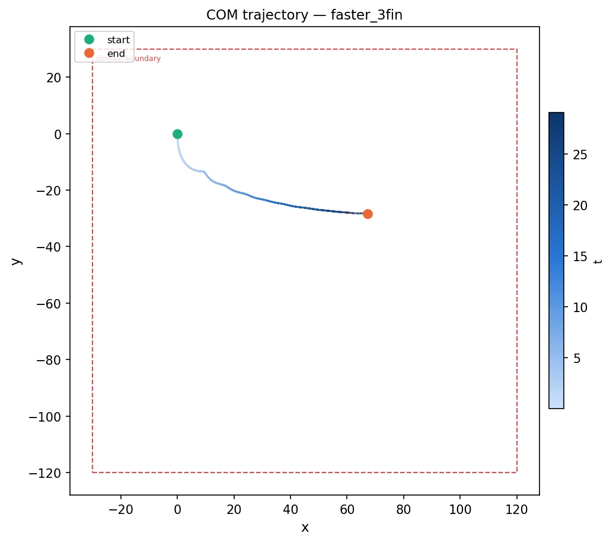

# Case: `faster_3fin`

**Cylinder with three fins — full z-span, periodic z.** Same physics and domain as
[`faster_midfin`](../faster_midfin/README.md) but with three fins equally spaced
at z-fractions 1/6, 1/2, and 5/6 (gap pattern: 1/6 · 1/3 · 1/3 · 1/6).

## Body (`geometry.json`)

| | |
|---|---|
| Shape | solid circular cylinder, axis along **z** |
| Radius | 3.17 (diameter D = 6.34) |
| Length | 35.0 (spans full z-domain) |
| End caps | none |
| Fins | 3 × radius 6.34 (2R) at z = 1/6, 1/2, 5/6 (layers 94, 280, 467 of 560) |
| IB points | 4,597,496 |

## Flow (`input3d`)

| | |
|---|---|
| Fluid | ρ = 1.0, μ = 0.01 |
| Domain | x ∈ [−30, 120], y ∈ [−120, 30], z ∈ [−17.5, 17.5] |
| Grid | 150 × 150 × 35 base, 4 levels, refinement 4·4·2 → finest dx = 0.0625 |
| z BC | **periodic** (`periodic_dimension = 0, 0, 1`) |
| Motion | prescribed: `U_infinity · cos(2πft)` with U = 1.0, **f = 0.6** |
| Constraint | `CONSTRAINT_VELOCITY`; translation tracked in x/y/z |
| Gravity | −981 · δ in y, active from **t = 0** |
| Run | END_TIME = 30, DT_MAX = 5e-4, CFL ≤ 0.3 |

Reynolds number based on diameter, ρUD/μ ≈ **634**.
Keulegan–Carpenter number U/(fD) ≈ **0.26**.
Buoyancy parameter δ = **0.011**.
Rotation frequency f = **0.6**.

## Fin series comparison

| Case | Fins | z-positions | IB points |
|------|------|-------------|-----------|
| `faster_nofin_full_span` | 0 | — | 4,524,800 |
| `faster_midfin` | 1 | 1/2 | 4,549,032 |
| `faster_2fin` | 2 | 1/4, 3/4 | 4,573,264 |
| `faster_3fin` | 3 | 1/6, 1/2, 5/6 | 4,597,496 |

## Results (job 14817768)

**Running** — reached t = 29.07 / 30 as of plot generation; ~1.4h wall-clock remaining.



Center of mass at t = 29.07: **(67.19, −28.26, 0.00)**

### Glide angle

Angle of COM trajectory below horizontal (arctan |Δy / Δx|):

| Phase | t range | Glide angle |
|-------|---------|-------------|
| Early | 2–3 | 48.2° |
| Mid | 10–12 | 19.8° |
| Late | 19–21 | 7.9° |
| Final (last 10%) | 26.2–29.1 | 2.5° |
| Overall avg | 2–29.1 | 17.1° |

Three fins dramatically flatten the trajectory — the glide angle drops to ~2.5° by t ≈ 26, meaning the cylinder moves nearly horizontally. Compare with the no-fin case (`faster_nofin_large`) which settles at ~39°.

## Regenerate

```bash
python3 tools/generate_vertex.py cases/faster_3fin          # rebuild mesh
python3 tools/generate_vertex.py cases/faster_3fin --check  # verify
IBAMR_SCRATCH_DIR=/scratch/$USER/3dRotatingCylinder python3 setup_run.py faster_3fin
```
