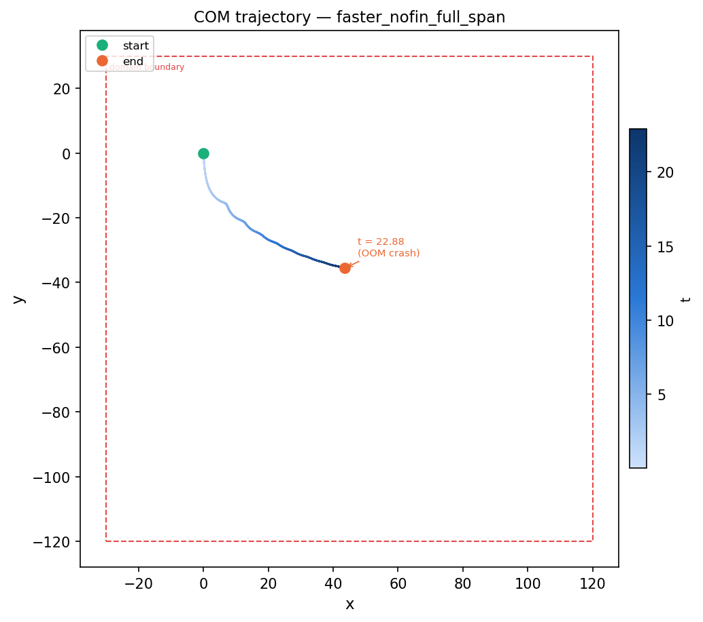

# Case: `faster_nofin_full_span`

**Bare cylinder — full z-span, periodic z.** Same physics and enlarged x/y domain
as [`faster_nofin_large`](../faster_nofin_large/README.md), but the cylinder length
is extended to match the full axial domain (L = Lz = 35) with z-direction periodic
boundary conditions. The cylinder is effectively infinite in the spanwise direction.

## Body (`geometry.json`)

| | |
|---|---|
| Shape | solid circular cylinder, axis along **z** |
| Radius | 3.17 (diameter D = 6.34) |
| Length | **35.0** (spans full z-domain) |
| End caps | none (`use_disk = 0`) |
| Fins | none |
| IB points | 4,524,800 |

## Flow (`input3d`)

| | |
|---|---|
| Fluid | ρ = 1.0, μ = 0.01 |
| Domain | x ∈ [−30, 120], y ∈ [−120, 30], z ∈ [−17.5, 17.5] |
| Grid | 150 × 150 × 35 base, 4 levels, refinement 4·4·2 → finest dx = 0.0625 |
| z BC | **periodic** (`periodic_dimension = 0, 0, 1`) |
| Motion | prescribed: `U_infinity · cos(2πft)` with U = 1.0, **f = 0.6** |
| Constraint | `CONSTRAINT_VELOCITY`; translation tracked in x/y/z |
| Gravity | −981 · δ in y, active from **t = 0** |
| Run | END_TIME = 30, DT_MAX = 5e-4, CFL ≤ 0.3 |

Reynolds number based on diameter, ρUD/μ ≈ **634**.
Keulegan–Carpenter number U/(fD) ≈ **0.26**.
Buoyancy parameter δ = **0.011**.
Rotation frequency f = **0.6**.

## Comparison with parent cases

| Parameter | `faster_nofin` | `faster_nofin_large` | `faster_nofin_full_span` |
|-----------|---------------|---------------------|--------------------------|
| Lx | 100 | 150 | 150 |
| Ly | 90 | 150 | 150 |
| x range | [−20, 80] | [−30, 120] | [−30, 120] |
| y range | [−72, 18] | [−120, 30] | [−120, 30] |
| Cylinder L | 25.5 | 25.5 | **35.0** |
| z BC | wall | wall | **periodic** |
| IB points | 3,296,640 | 3,296,640 | **4,524,800** |

## Results (job 14817761)

**Out of memory** — reached t = 22.88 / 30 (45,760 of ~60,000 timesteps, ~20.4h wall-clock, 128 cores) before the node's 513 GB RAM was exhausted.



Final center of mass at crash: **(43.55, −35.58, 0.00)**

### Glide angle

Angle of COM trajectory below horizontal (arctan |Δy / Δx|):

| Phase | t range | Glide angle |
|-------|---------|-------------|
| Early | 2–3 | 62.3° |
| Mid | 10–12 | 27.5° |
| Late | 19–21 | 17.0° |
| Final (last 10%) | 20.6–22.9 | 14.0° |
| Overall avg | 2–22.9 | 32.6° |

The glide angle is still decreasing at crash time — steady state not reached.

**Next step:** restart from last checkpoint with a memory-reduced configuration (e.g. reduce base grid resolution or increase MPI ranks to distribute memory).

## Regenerate

```bash
python3 tools/generate_vertex.py cases/faster_nofin_full_span          # rebuild mesh
python3 tools/generate_vertex.py cases/faster_nofin_full_span --check  # verify
IBAMR_SCRATCH_DIR=/scratch/$USER/3dRotatingCylinder python3 setup_run.py faster_nofin_full_span
```
