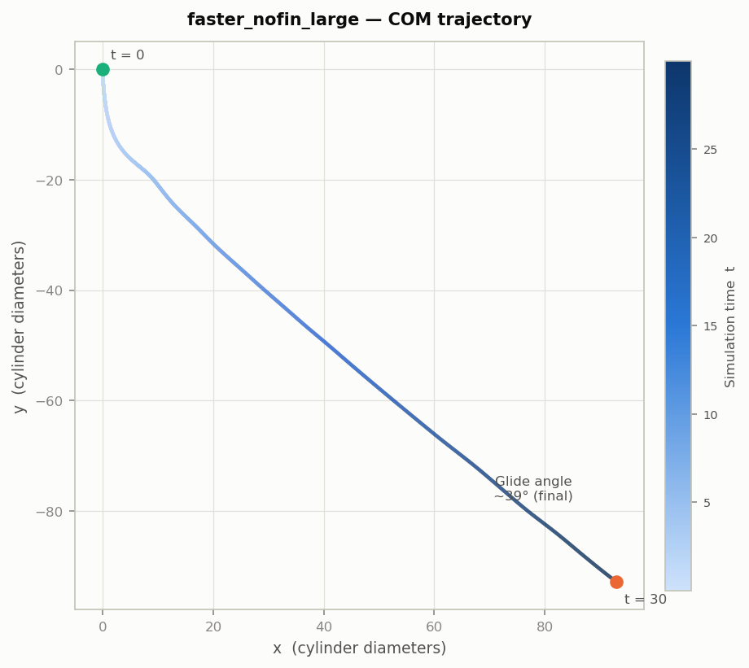

# Case: `faster_nofin_large`

**Bare cylinder — enlarged domain.** Identical physics to [`faster_nofin`](../faster_nofin/README.md)
but with a wider computational domain (Lx 100→150, Ly 90→150) to allow the
cylinder to glide for the full simulation time t = 30 without exiting the domain.

The coarse grid spacing is preserved (Nx/Lx = Ny/Ly = 1.0), so the finest
resolution is unchanged.

## Why this case exists

In `faster_nofin` (job 14497777) the cylinder's center of mass reached
(63.9, −67.5) at t = 21.55, hitting the y lower boundary (y = −72) with
insufficient ghost cells for the IB_4 kernel. The projected endpoint at t = 30
is approximately (89, −94). This case adds ~30 units of buffer in both
directions.

## Body (`geometry.json`)

Same as `faster_nofin` — unchanged cylinder.

| | |
|---|---|
| Shape | solid circular cylinder, axis along **z** |
| Radius | 3.17 (diameter D = 6.34) |
| Length | 25.5 |
| End caps | none (`use_disk = 0`) |
| Fins | none |
| IB points | 3,296,640 — one per finest Eulerian cell, spacing 0.0625 |

## Flow (`input3d`)

| | |
|---|---|
| Fluid | ρ = 1.0, μ = 0.01 |
| Domain | x ∈ [−30, 120], y ∈ [−120, 30], z ∈ [−17.5, 17.5] |
| Grid | 150 × 150 × 35 base, 4 levels, refinement 4·4·2 → finest dx = 0.0625 |
| Motion | prescribed: `U_infinity · cos(2πft)` with U = 1.0, **f = 0.6** |
| Constraint | `CONSTRAINT_VELOCITY`; translation tracked in x/y/z, no rotation |
| Gravity | −981 · δ in y, active from **t = 0** |
| Upper-y BC | **open** (traction: a = 0, b = 1) |
| Run | END_TIME = 30, DT_MAX = 5e-4, CFL ≤ 0.3 |

Reynolds number based on diameter, ρUD/μ ≈ **634**.
Keulegan–Carpenter number U/(fD) ≈ **0.26**.
Buoyancy parameter δ = **0.011**.
Rotation frequency f = **0.6**.

## Results (job 14802446)

**Completed successfully** — all 60,000 timesteps to t = 30 (15h wall-clock, 128 cores).



Final center of mass: **(92.94, −92.82, −0.35)** — well within the expanded domain.

### Glide angle

Angle of COM trajectory below horizontal (arctan |Δy / Δx|):

| Phase | t range | Glide angle |
|-------|---------|-------------|
| Early | 2–3 | 64.8° |
| Mid | 10–12 | 41.5° |
| Late | 19–21 | 39.1° |
| Final (last 10%) | 27–30 | 39.1° |
| Overall avg | 2–30 | 42.4° |

The trajectory settles to ~39° by t ≈ 20 and remains steady. Compare with
`faster_nofin` (crashed at t = 21.5, final angle ~33° — measured over fewer
cycles in the smaller domain).

## Domain comparison vs `faster_nofin`

| Parameter | `faster_nofin` | `faster_nofin_large` |
|-----------|---------------|---------------------|
| Lx | 100 | 150 |
| Ly | 90 | 150 |
| Nx (coarse) | 100 | 150 |
| Ny (coarse) | 90 | 150 |
| x range | [−20, 80] | [−30, 120] |
| y range | [−72, 18] | [−120, 30] |
| finest dx | 0.0625 | 0.0625 (unchanged) |

## Notes

Despite the repository name, the body here is **oscillated, not rotated** —
`calculate_rotational_momentum` is `0,0,0` and the kinematics are a pure
translational cosine.

The gravity vector carries a multiplier (δ = `0.011`), so it acts as a reduced
effective gravity rather than full 981; the solid and fluid densities are set
equal (`rho_solid = rho_fluid`), supplying the net body force directly.

## Regenerate

```bash
python3 tools/generate_vertex.py cases/faster_nofin_large          # rebuild mesh
python3 tools/generate_vertex.py cases/faster_nofin_large --check  # verify
IBAMR_SCRATCH_DIR=/scratch/$USER/3dRotatingCylinder python3 setup_run.py faster_nofin_large
```
